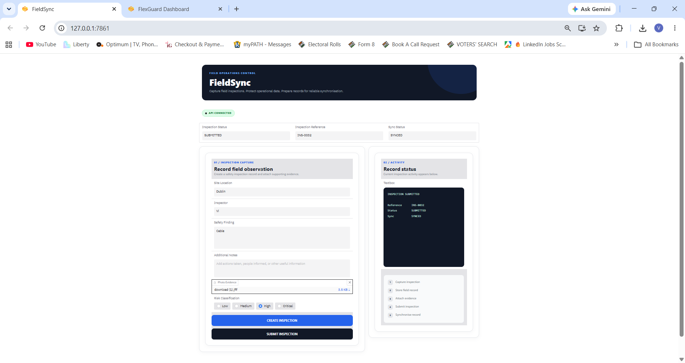
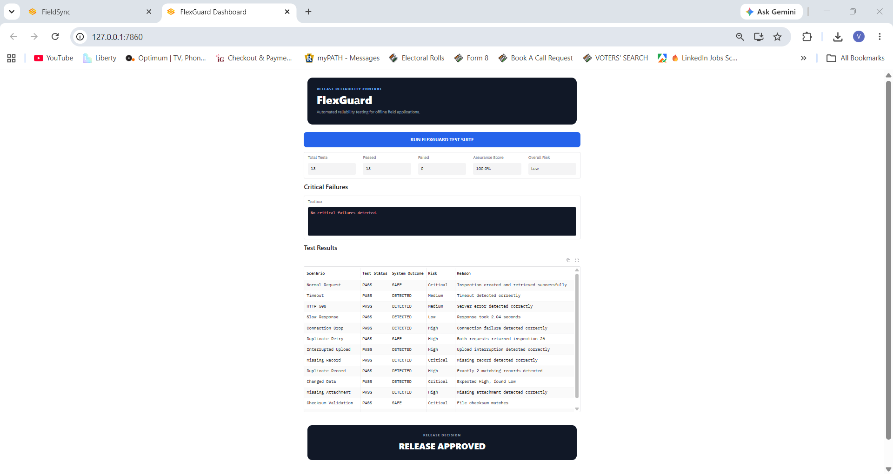
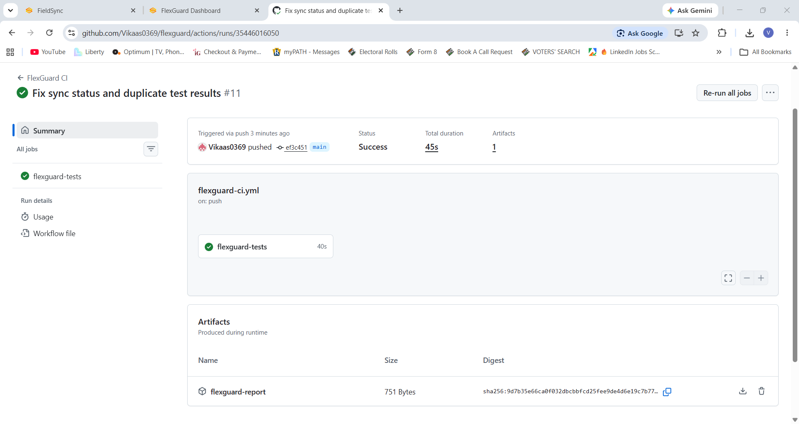

# FlexGuard

FlexGuard is a risk-based reliability testing project for field applications that may operate under unstable connectivity and failure conditions.

The project contains two main parts:

- **FieldSync**, a small field inspection application used as the system under test
- **FlexGuard**, a reliability assurance system that injects failures, checks data integrity, evaluates risk, and produces a release decision

This is an independent portfolio project. It is not affiliated with FlexManager and does not test or access FlexManager software.

---

## Why FlexGuard

Field applications can operate in environments where connectivity is slow, unstable, or temporarily unavailable.

A successful request under normal conditions does not prove that an application will behave correctly when:

- a request times out
- the server returns an HTTP 500 error
- connectivity drops
- the same request is retried
- an upload is interrupted
- records disappear
- duplicate records are created
- stored data changes unexpectedly
- attachments are missing
- uploaded files are corrupted

FlexGuard was built to simulate and detect these conditions automatically.

---

## Architecture

```text
                     FIELD USER
                         |
                         v
                +-------------------+
                |   FieldSync UI    |
                |      :7861        |
                +---------+---------+
                          |
                          v
                +-------------------+
                |   FieldSync API   |
                | FastAPI + SQLite  |
                |      :8000        |
                +---------^---------+
                          |
                          |
                +---------+---------+
                |   Chaos Proxy     |
                |      :9000        |
                +---------^---------+
                          |
                          |
                +---------+---------+
                |    FlexGuard      |
                | Reliability Tests |
                | Dashboard :7860   |
                +---------+---------+
                          |
                          v
                  Risk Assessment
                          |
                          v
                  Release Decision
                          |
                          v
                   GitHub Actions
```

---

## FieldSync

FieldSync is the example field application used by FlexGuard.

It allows a user to:

- create an inspection
- enter inspector information
- record findings
- add notes
- assign a risk level
- upload image evidence
- submit an inspection
- view synchronization status

FieldSync also includes offline and retry behavior to simulate a field application operating with unreliable connectivity.

### FieldSync capabilities

| Capability | Purpose |
|---|---|
| Inspection creation | Capture field inspection information |
| Evidence upload | Attach image evidence |
| Submission | Submit completed inspection records |
| Offline queue | Store records when the backend is unavailable |
| Retry | Retry pending records after connectivity returns |
| Idempotency | Prevent duplicate records during repeated requests |
| Sync status | Track pending, synced, and failed records |

---

## FlexGuard Test Engine

FlexGuard currently runs 13 reliability and data-integrity scenarios.

| Scenario | Purpose |
|---|---|
| Normal Request | Verify normal create and retrieve behavior |
| Timeout | Detect requests that exceed the allowed response time |
| HTTP 500 | Detect server-side failures |
| Slow Response | Detect degraded response performance |
| Connection Drop | Detect unavailable network connections |
| Duplicate Retry | Verify idempotent retry behavior |
| Interrupted Upload | Detect interrupted evidence uploads |
| Missing Record | Detect records that disappear after creation |
| Duplicate Record | Detect duplicate stored records |
| Changed Data | Detect unexpected changes to stored information |
| Missing Attachment | Detect missing evidence files |
| Checksum Validation | Verify uploaded file integrity |
| Failure Replay | Record retry attempts and final failure state |

---

## Test Status and System Outcome

FlexGuard separates the status of the test from the condition found in the application.

### Test Status

**PASS**

The FlexGuard check executed correctly and verified the expected condition.

**FAIL**

The FlexGuard check could not verify the expected behavior.

### System Outcome

**SAFE**

The tested behavior completed without an integrity problem.

**DETECTED**

FlexGuard successfully detected an intentionally injected failure condition.

**UNSAFE**

A reliability or integrity check failed and requires attention.

This distinction is important because an intentionally generated HTTP 500 can still result in a successful FlexGuard test when the failure is correctly detected.

---

## Risk Engine

Each scenario is assigned a risk level:

```text
Low
Medium
High
Critical
```

FlexGuard uses weighted risk values when calculating the final Assurance Score.

Example successful run:

```text
Total Tests:        13
Passed:             13
Failed:             0
Assurance Score:    100.0%
Overall Risk:       Low
```

---

## Release Decision

FlexGuard converts test results into a release decision.

```text
Critical UNSAFE outcome
        |
        v
   BLOCK RELEASE


No critical unsafe outcome
but Assurance Score < 95
        |
        v
   REVIEW REQUIRED


No critical unsafe outcome
and Assurance Score >= 95
        |
        v
   RELEASE APPROVED
```

The release-gate logic is also validated with automated pytest tests.

---

## Failure Replay

FlexGuard records retry behavior so a failure can be understood after the test.

Example:

```text
Request started
Retry attempt 1
Server returned HTTP 500
Retry required
Retry attempt 2
Server returned HTTP 500
Retry required
Retry attempt 3
Server returned HTTP 500
Maximum retries reached
Final state: FAILED
```

This provides a simple sequence showing what happened before the final state was reached.

---

## Dashboard

The FlexGuard dashboard displays:

- total tests
- passed tests
- failed tests
- Assurance Score
- overall risk
- critical unsafe outcomes
- scenario results
- release decision

Each scenario displays:

```text
Scenario
Test Status
System Outcome
Risk
Reason
```

---

## Screenshots

### FieldSync

FieldSync captures and submits field inspection records with evidence, risk classification, and synchronization status.



### FlexGuard Reliability Dashboard

FlexGuard runs reliability and data-integrity scenarios and reports test status, system outcome, risk, assurance score, and release decision.



### CI/CD Release Validation

GitHub Actions automatically runs the release-gate tests and FlexGuard reliability suite on pushes and pull requests.



## CI/CD

FlexGuard uses GitHub Actions to run reliability checks automatically.

The workflow runs on pushes and pull requests to the main branch.

```text
Checkout repository
        |
        v
Install dependencies
        |
        v
Test release-gate logic
        |
        v
Start FieldSync API
        |
        v
Start Chaos Proxy
        |
        v
Run FlexGuard scenarios
        |
        v
Generate JSON report
        |
        v
Critical UNSAFE outcome?
      /     \
    Yes      No
     |        |
     v        v
   FAIL      PASS
```

The generated FlexGuard report is uploaded as a GitHub Actions artifact.

---

## Running the Project

### 1. Create a virtual environment

Windows:

```powershell
python -m venv .venv
.venv\Scripts\Activate.ps1
```

### 2. Install dependencies

```powershell
pip install -r requirements.txt
```

### 3. Start the complete environment

```powershell
python app.py
```

One command starts the complete FlexGuard lab.

```text
FieldSync API
http://127.0.0.1:8000

FastAPI Documentation
http://127.0.0.1:8000/docs

Chaos Proxy
http://127.0.0.1:9000

FlexGuard Dashboard
http://127.0.0.1:7860

FieldSync Application
http://127.0.0.1:7861
```

The FieldSync application and FlexGuard dashboard open automatically in separate browser tabs.

---

## Demo Flow

### 1. Create an inspection

Open FieldSync and enter:

```text
Location
Inspector
Finding
Notes
Risk Level
Evidence
```

Create and submit the inspection.

### 2. Show the FieldSync API

Open:

```text
http://127.0.0.1:8000/docs
```

This shows the FastAPI endpoints supporting the application.

### 3. Run FlexGuard

Switch to the FlexGuard dashboard and click:

```text
RUN FLEXGUARD TEST SUITE
```

FlexGuard executes the reliability and data-integrity scenarios.

### 4. Review the results

The dashboard shows:

```text
Test Status
System Outcome
Risk
Reason
Assurance Score
Overall Risk
Critical Unsafe Outcomes
Release Decision
```

### 5. Show CI/CD

Open the GitHub Actions workflow and show that the same release checks execute automatically during CI.

---

## Technology Stack

| Area | Technology |
|---|---|
| Language | Python |
| Backend API | FastAPI |
| User Interface | Gradio |
| Database | SQLite |
| ORM | SQLAlchemy |
| HTTP testing | HTTPX |
| Automated tests | Pytest |
| CI/CD | GitHub Actions |
| Source control | Git and GitHub |

---

## Project Structure

```text
FlexGuard/
|
|-- app.py
|
|-- fieldsync/
|   |-- __init__.py
|   |-- main.py
|   |-- database.py
|   |-- models.py
|   |-- frontend.py
|   `-- offline_queue.py
|
|-- guard_engine/
|   |-- __init__.py
|   |-- runner.py
|   |-- replay.py
|   |-- risk_engine.py
|   |-- dashboard.py
|   |-- ci_runner.py
|   |
|   |-- chaos/
|   |   |-- __init__.py
|   |   `-- proxy.py
|   |
|   `-- scenarios/
|       |-- normal_request.py
|       |-- timeout_request.py
|       |-- http_500.py
|       |-- slow_response.py
|       |-- connection_drop.py
|       |-- duplicate_retry.py
|       |-- interrupted_upload.py
|       |-- missing_record.py
|       |-- duplicate_record.py
|       |-- changed_data.py
|       |-- missing_attachment.py
|       |-- checksum_validation.py
|       `-- failure_replay.py
|
|-- tests/
|   `-- test_release_gate.py
|
|-- reports/
|-- uploads/
|
|-- requirements.txt
|-- .gitignore
|-- LICENSE
`-- README.md
```

---

## Engineering Concepts Demonstrated

FlexGuard was built to demonstrate practical experience with:

- API development
- automated testing
- failure injection
- network fault simulation
- offline workflows
- retry handling
- idempotency
- data-integrity validation
- checksum verification
- failure replay
- risk-based testing
- automated release decisions
- CI/CD release gates
- GitHub Actions
- application observability and debugging

---

## Scope and Limitations

FlexGuard is a portfolio reliability-engineering project.

FieldSync is a purpose-built demonstration application created specifically as the system under test.

The project does not integrate with, reverse engineer, test, or make claims about the reliability of FlexManager or any other commercial field-management platform.

The current chaos environment is designed for demonstration and engineering validation rather than production-scale distributed load testing.

---

## Author

**Vikas Y**

Software and DevOps Engineer

GitHub: **Vikaas0369**